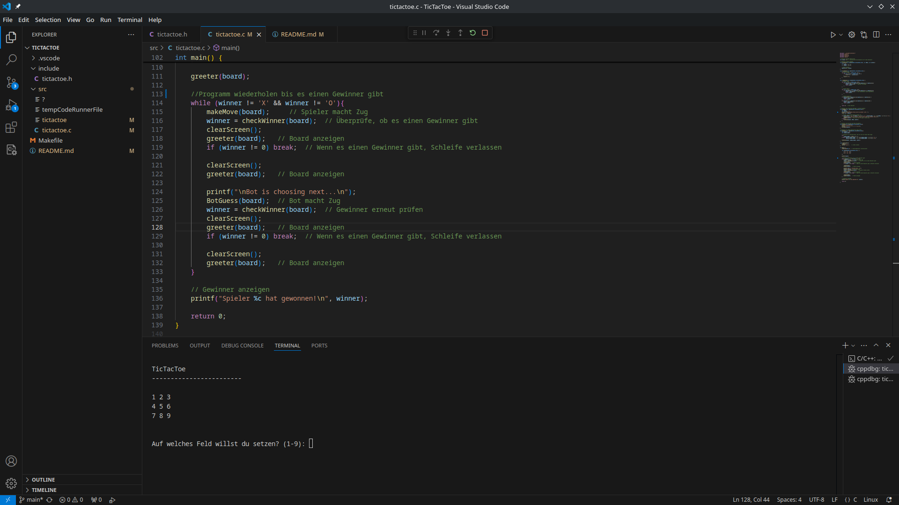

# TicTacToe

## Beschreibung
Ich habe in C TicTacToe programmiert, weil ich nix besseres zu tun habe. Es ist ein normales TicTacToe, jedoch spielt man gegen einen "Bot", welcher einfach random generierte Einträge von 1-9 nimmt.

### Wichtig: kompiliert auf Arch Linux, wird nicht auf Windows funktionieren

## Anwendung
Kann einfach in VSC mit der C/C++ Extension von Microsoft ausgeführt werden. 

